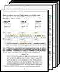
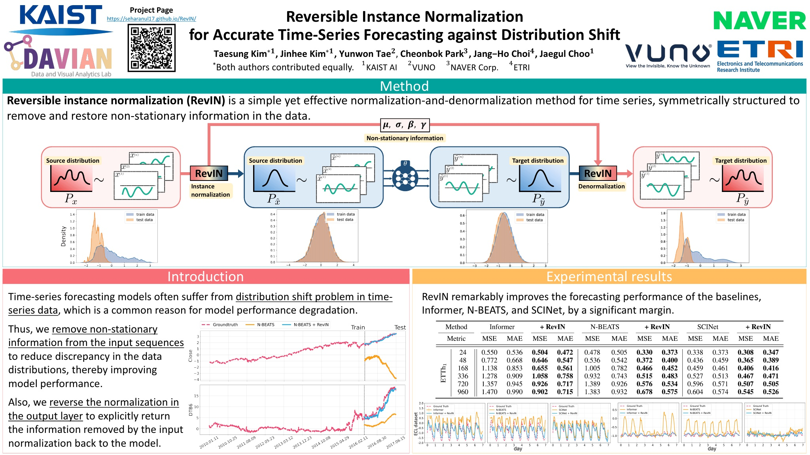
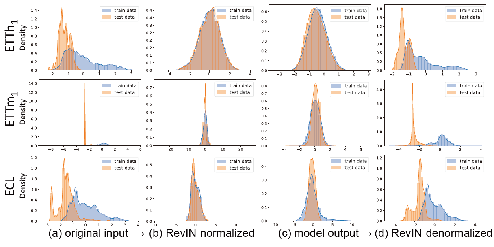
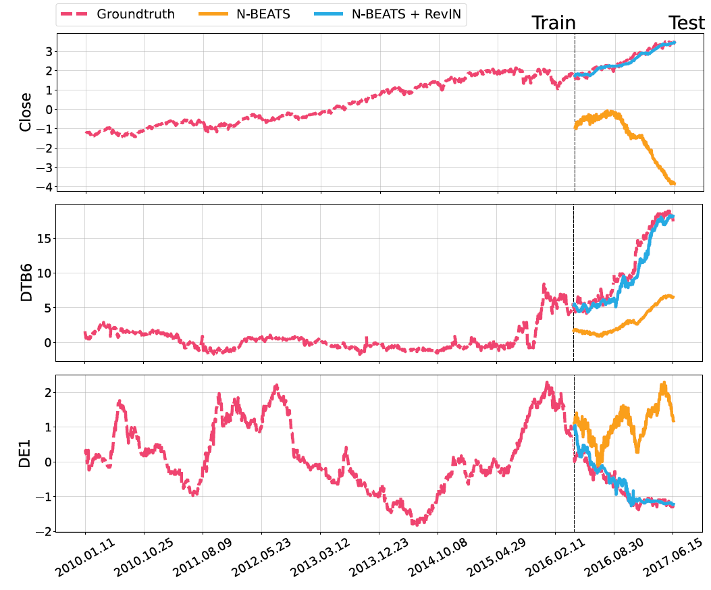
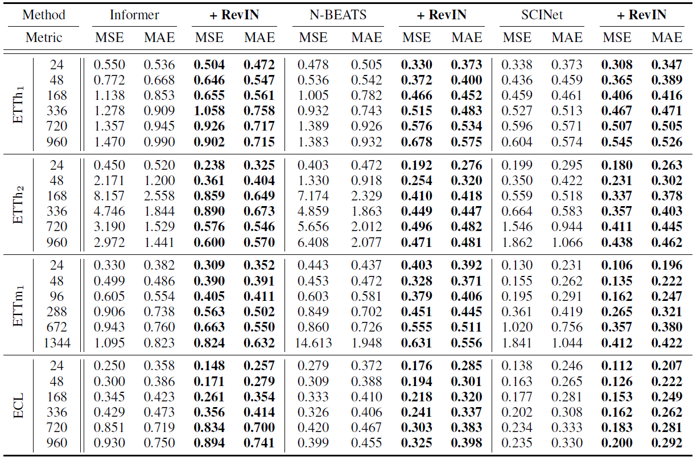
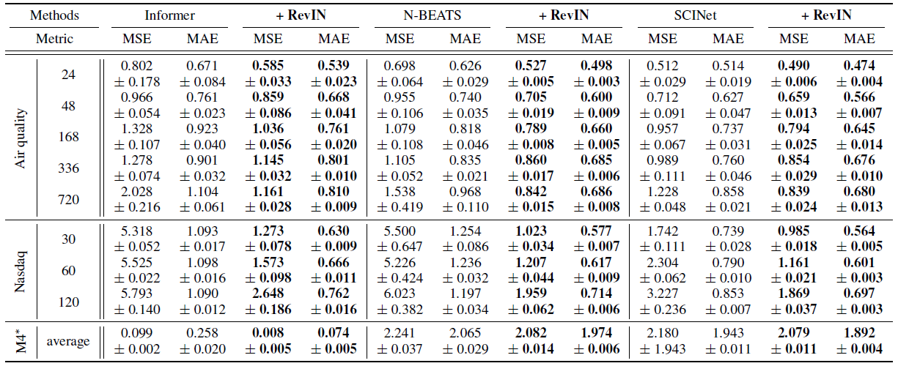
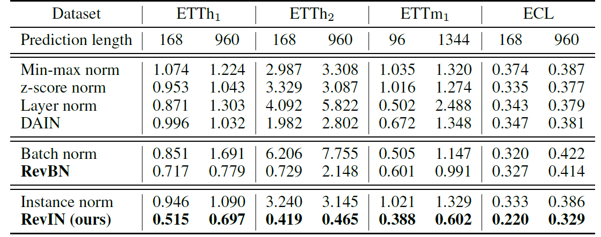
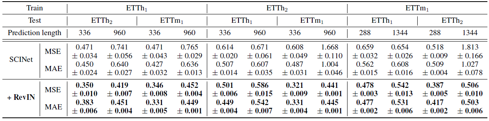

# <center> RevIN </center> 
## <center> Reversible Instance Normalization for Accurate Time-Series Forecasting against Distribution Shift </center>
## <center>ICLR 2022</center>


<center>
<a href="https://github.com/ts-kim/">Taesung Kim*</a> &nbsp;&nbsp;&nbsp;&nbsp;&nbsp;&nbsp;&nbsp;&nbsp;&nbsp; 
<a href="https://sites.google.com/view/jinhee-kim">Jinhee Kim*</a> &nbsp;&nbsp;&nbsp;  &nbsp;&nbsp;&nbsp;&nbsp;&nbsp;&nbsp;
<a href="https://openreview.net/profile?id=~Yunwon_Tae1">Yunwon Tae</a> &nbsp;&nbsp;&nbsp; &nbsp;&nbsp;&nbsp;&nbsp;&nbsp;&nbsp; 
<a href="https://cbokpark.github.io/">Cheonbok Park</a> &nbsp;&nbsp;&nbsp;  &nbsp;&nbsp;&nbsp;&nbsp;&nbsp;&nbsp; 
<a href="https://github.com/jangho87">Jang-Ho Choi</a> &nbsp;&nbsp;&nbsp;  &nbsp;&nbsp;&nbsp;&nbsp;&nbsp;&nbsp; 
<a href="https://sites.google.com/site/jaegulchoo/">Jaegul Choo</a>
</center>

<center>
KAIST AI &nbsp;&nbsp;&nbsp;&nbsp;&nbsp;&nbsp;&nbsp;&nbsp;&nbsp;&nbsp;&nbsp;&nbsp;&nbsp;&nbsp;&nbsp;
KAIST AI &nbsp;&nbsp;&nbsp; &nbsp;&nbsp;&nbsp;&nbsp;&nbsp;&nbsp; &nbsp;&nbsp;&nbsp;&nbsp;&nbsp;&nbsp;
VUNO &nbsp;&nbsp;&nbsp;  &nbsp;&nbsp;&nbsp;&nbsp;&nbsp;&nbsp; &nbsp;&nbsp;&nbsp;&nbsp;&nbsp;
NAVER Corp. &nbsp;&nbsp;&nbsp; &nbsp;&nbsp;&nbsp;&nbsp;&nbsp;&nbsp; &nbsp;&nbsp;&nbsp;&nbsp;&nbsp;&nbsp;&nbsp;&nbsp;
ETRI &nbsp;&nbsp;&nbsp;  &nbsp;&nbsp;&nbsp;&nbsp;&nbsp;&nbsp; &nbsp;&nbsp;&nbsp;&nbsp;&nbsp;&nbsp;&nbsp;&nbsp;
KAIST AI
</center>

<center>
*Denotes Equal Contribution
</center>


<table  style="background:blue"><tr></tr><tr>
<td> <a href="https://openreview.net/forum?id=cGDAkQo1C0p"></a></td>
<td>
<td> <a href="https://github.com/ts-kim/revin/"></a> </td>
</tr></table>

</img>


# Poster
</img>


# Abstract

Statistical properties such as mean and variance often change over time in time series, i.e., time-series data suffer from a distribution shift problem. This change in temporal distribution is one of the main challenges that prevent accurate time-series forecasting. To address this issue, we propose a simple yet effective normalization method called reversible instance normalization (RevIN), a generally applicable normalization-and-denormalization method with learnable affine transformation. The proposed method is symmetrically structured to remove and restore the statistical information of a time-series instance, leading to significant performance improvements in time-series forecasting, as shown in Fig. 1. We demonstrate the effectiveness of RevIN via extensive quantitative and qualitative analyses on various real-world datasets, addressing the distribution shift problem.

# Experimental Results

RevIN can alleviate the distribution discrepancy problem by removing
non-stationary information in the input layer and then restoring it in the output layer. The
analysis is conducted on the ETT and ECL datasets using SCINet (Liu et al., 2021) as the baseline.
</img>


These are prediction results on three variables in the Nasdaq data,
Close, DTB6, and DE1, to verify the effectiveness
of RevIN on obvious non-stationary time series.
</img>


RevIN
consistently outperforms all three baselines, Informer, N-BEATS, and SCINet, by a large margin, showing robust performance against the prediction length.
</img>


</img>


RevIN shows outstanding performance compared to classical and state-of-the-art normalization methods normalization methods,
</img>


In time series, a domain can be a location of a sensor where
the data is collected. Here, RevIN successfully solves the distribution shift problem by alleviating data distribution discrepancy between different domains, leading to better generalization performance in the cross-domain time-series forecasting task.
</img>


Additional multivariate time-series forecasting results.
 

</img>


# Citation

```
@inproceedings{
    kim2022reversible,
    title={Reversible Instance Normalization for Accurate Time-Series Forecasting against Distribution Shift},
    author={Taesung Kim and Jinhee Kim and Yunwon Tae and Cheonbok Park and Jang-Ho Choi and Jaegul Choo},
    booktitle={International Conference on Learning Representations},
    year={2022},
    url={https://openreview.net/forum?id=cGDAkQo1C0p}
}
```
